# 🛡️ PayShield — Intelligent Transaction Risk & Payment Management System


PayShield is a transaction risk and payment management system built using **Core Java, JDBC, and MySQL**. The system analyzes transactions using multiple fraud-detection rules, calculates a risk score, generates fraud alerts, and provides a user-to-admin transaction review workflow.

The project is being developed incrementally, starting with a Core Java and MySQL implementation and gradually evolving toward a **Spring Boot, REST API, secure, scalable, cloud-based and AI-powered fraud detection system**.

---

## 📌 Overview

Financial applications need to identify suspicious transactions before allowing them to proceed.

PayShield demonstrates this process by analyzing transaction characteristics such as:

- Transaction amount
- Transaction frequency
- Duplicate transaction patterns
- Transaction location
- Previous transaction activity

Based on these indicators, the system calculates a **fraud risk score** and assigns a risk level.

```text
Transaction
     ↓
Fraud Detection
     ↓
Risk Score
     ↓
Risk Classification
     ↓
LOW / MEDIUM / HIGH
     ↓
Fraud Alert (if required)
     ↓
User Explanation
     ↓
Admin Review
     ↓
Approve / Reject
     ↓
User Status
```

---

# ⭐ What Makes PayShield Different?

PayShield is designed as more than a simple CRUD application.

It demonstrates a complete transaction-risk workflow:

**Transaction Processing + Fraud Detection + Risk Scoring + Alerts + Manual Review + Decision Tracking**

The project also has a planned evolution path from:

```text
Core Java
     ↓
JDBC + MySQL
     ↓
Rule-Based Fraud Detection
     ↓
Spring Boot
     ↓
REST APIs
     ↓
JWT Security
     ↓
Redis
     ↓
Docker
     ↓
AWS
     ↓
Microservices
     ↓
Machine Learning
```

---

# 📑 Table of Contents

- [Core Features](#-core-features)
- [System Workflow](#-system-workflow)
- [Application Screenshots](#-application-screenshots)
- [Fraud Detection Engine](#-fraud-detection-engine)
- [Risk Classification](#-risk-classification)
- [Transaction Review Workflow](#-transaction-review-workflow)
- [Application Architecture](#-application-architecture)
- [Project Structure](#-project-structure)
- [Database Design](#-database-design)
- [Technology Stack](#-technology-stack)
- [Current Implementation](#-current-implementation)
- [Future Roadmap](#-future-roadmap)
- [Security Notes](#-security-notes)
- [Sample Data](#-sample-data)
- [How to Run](#-how-to-run)
- [Application Flow](#-application-flow)
- [Learning Objectives](#-learning-objectives)
- [Project Evolution](#-project-evolution)
- [Why This Project](#-why-this-project)
- [Long-Term Architecture](#-long-term-architecture)
- [Repository Documentation](#-repository-documentation)
- [Contributing](#-contributing)
- [Project Status](#-project-status)
- [Author](#-author)
- [License](#-license)

---

# 🚀 Core Features

## 👤 User Features

- Create transactions
- Enter sender and receiver details
- Enter transaction amount
- Select transaction type
- Enter transaction location
- Automatically analyze transaction risk
- View transaction status
- Submit an explanation for flagged transactions
- View transaction review results
- Track approval or rejection status

## 🛡️ Fraud Detection Features

- High transaction amount detection
- High-frequency transaction detection
- Duplicate transaction detection
- Location-based anomaly detection
- Risk score calculation
- Risk classification
- Fraud alert generation
- Automatic transaction flagging

## 👨‍💼 Admin Features

- View transaction dashboard
- View pending transaction reviews
- View fraud-risk information
- View user explanations
- Approve suspicious transactions
- Reject suspicious transactions
- Monitor transaction review status

## 🗄️ Database Features

- MySQL relational database
- Foreign key relationships
- Indexed transaction data
- Separate fraud risk records
- Separate fraud alert records
- Separate transaction review records

---

# 🔄 System Workflow

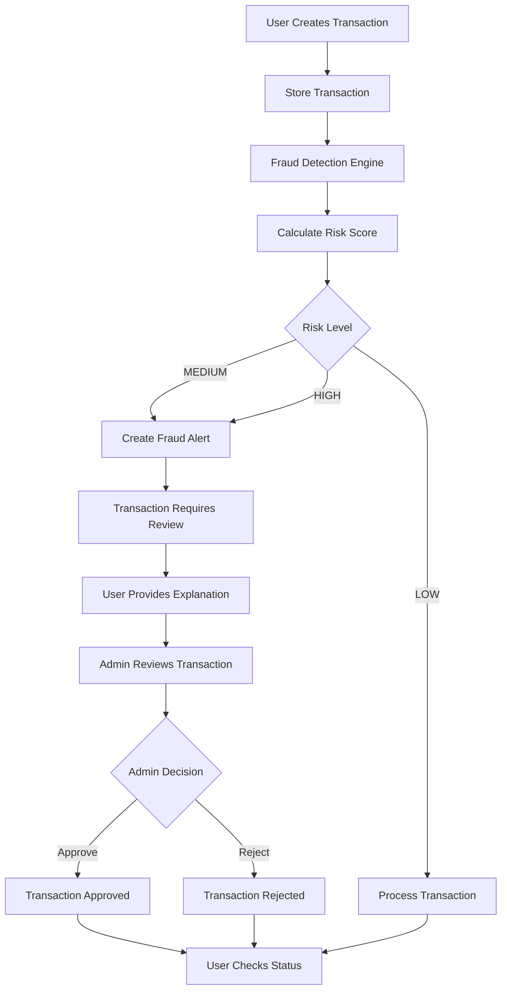

---

# 📸 Application Screenshots

The following screenshots show the actual PayShield application workflow.

## Main Menu

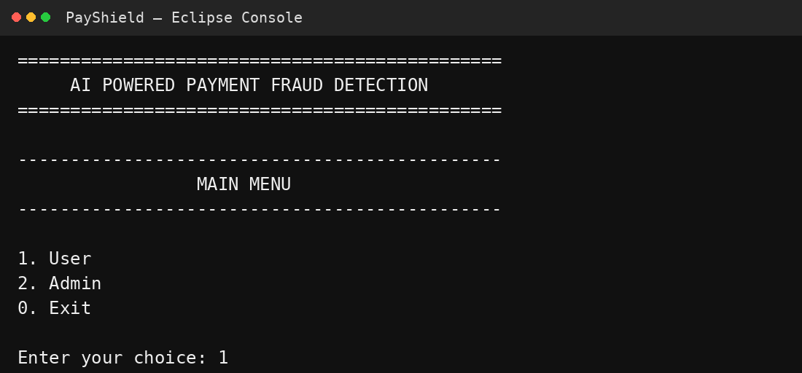

## User Creates Transaction

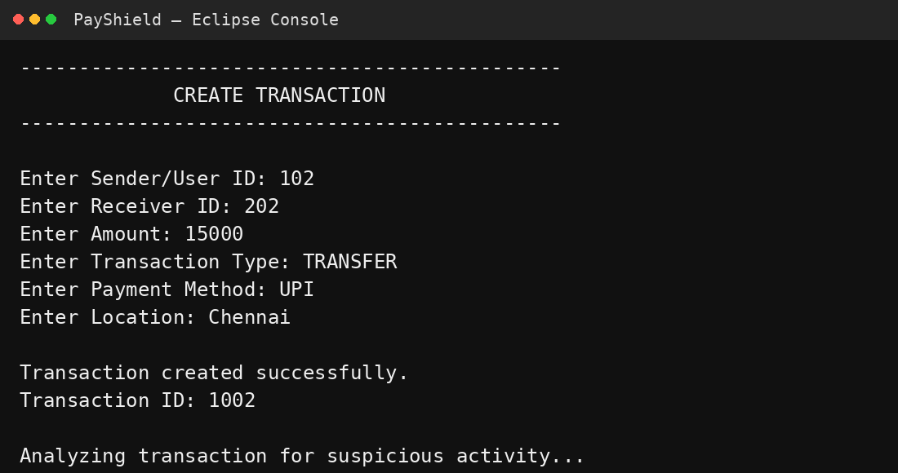

## Fraud Alert

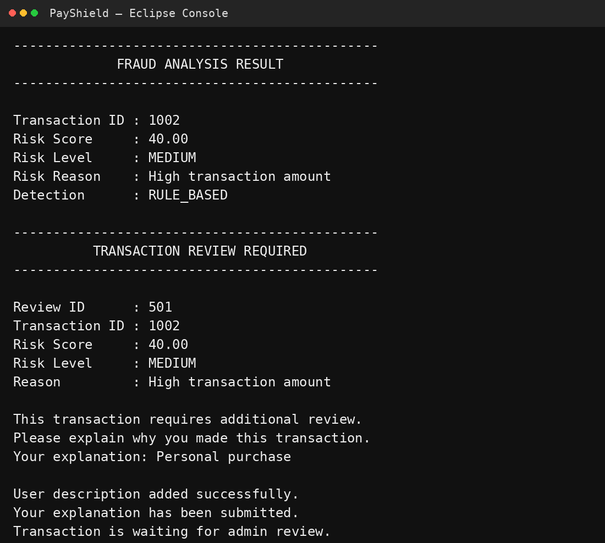

## Admin Dashboard

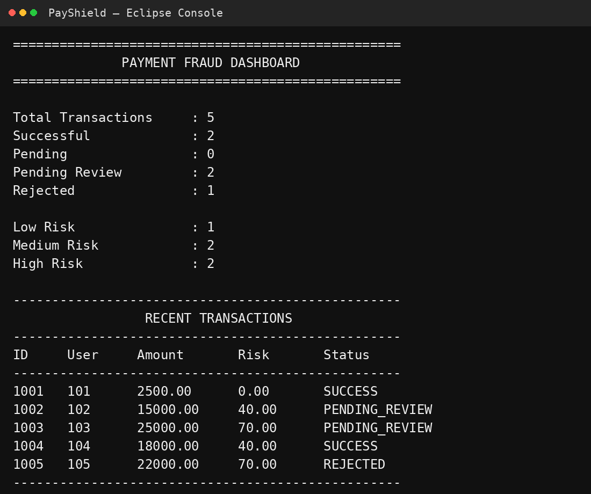

## Admin Review

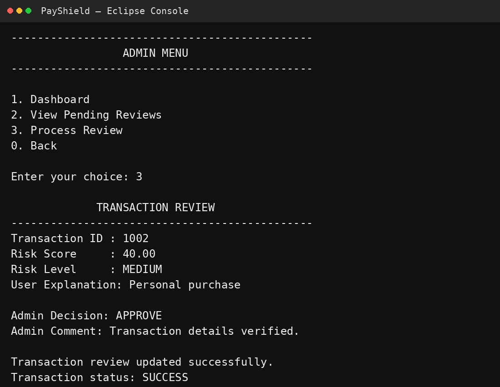

## User Transaction Status

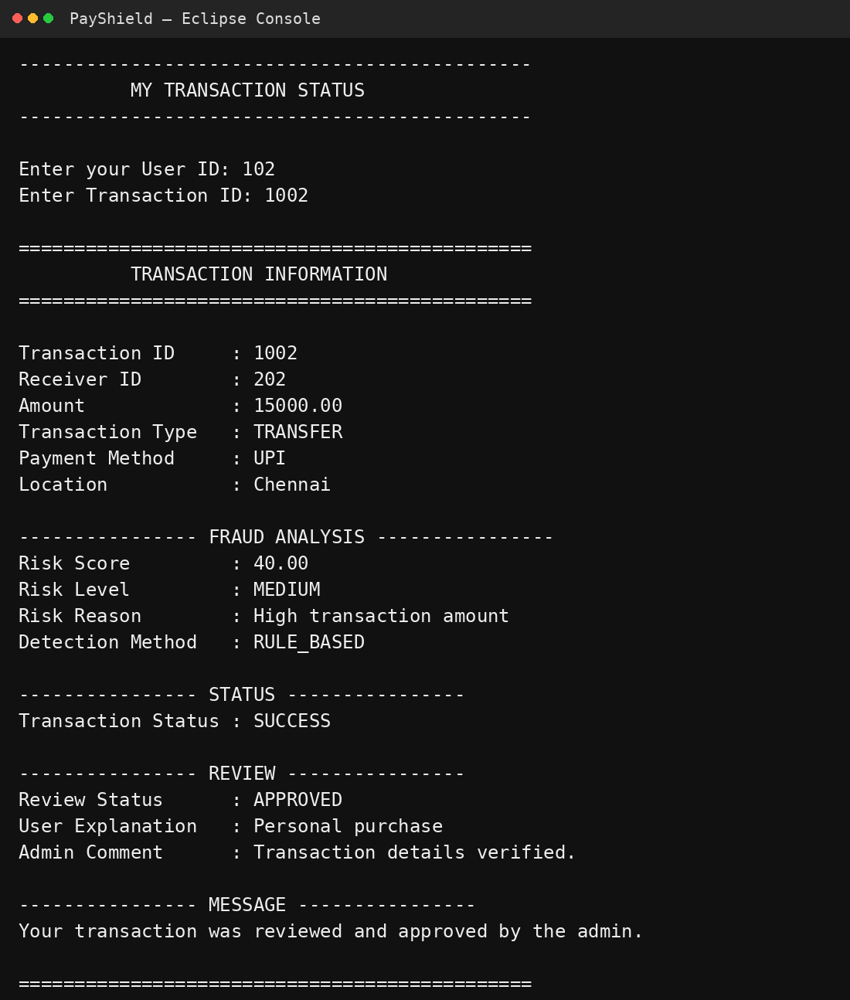

---

# 🔍 Fraud Detection Engine

The current PayShield fraud detection engine is **rule-based**.

The main fraud detection logic is implemented in:

```text
src/service/FraudDetectionService.java
```

The system evaluates every transaction against multiple risk indicators.

## Rule 1 — High Transaction Amount

If the transaction amount is greater than ₹10,000:

```text
Risk Score = +40
```

## Rule 2 — High Transaction Frequency

If more than 3 previous transactions are detected within a 10-minute window:

```text
Risk Score = +30
```

## Rule 3 — Duplicate Transaction

If the same sender, receiver, amount, and transaction type are detected within a 5-minute window:

```text
Risk Score = +20
```

## Rule 4 — Different Location

If the transaction location differs from the user's recent transaction location within a 10-minute window:

```text
Risk Score = +30
```

---

# 📊 Risk Classification

The final risk score is converted into a risk level.

| Risk Score | Risk Level |
|---:|---|
| `< 30` | 🟢 LOW |
| `30 – 69` | 🟡 MEDIUM |
| `70+` | 🔴 HIGH |

### Example

```text
Transaction Amount       = ₹15,000
High Amount              = +40
High Frequency           = +30
Different Location       = +30

Total Risk Score         = 100
Risk Level               = HIGH
```

Transactions with medium or high risk can be sent through the transaction review workflow.

---

# 📝 Transaction Review Workflow

When a transaction is flagged, the user can provide an explanation which is stored in the database.

The administrator can then review the transaction and make a decision.

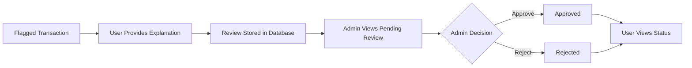

This creates a complete feedback loop:

```text
Flagged Transaction
        ↓
User Explanation
        ↓
Admin Review
        ↓
Approve / Reject
        ↓
User Status
```

---

# 🏗️ Application Architecture

The current application follows a layered architecture.

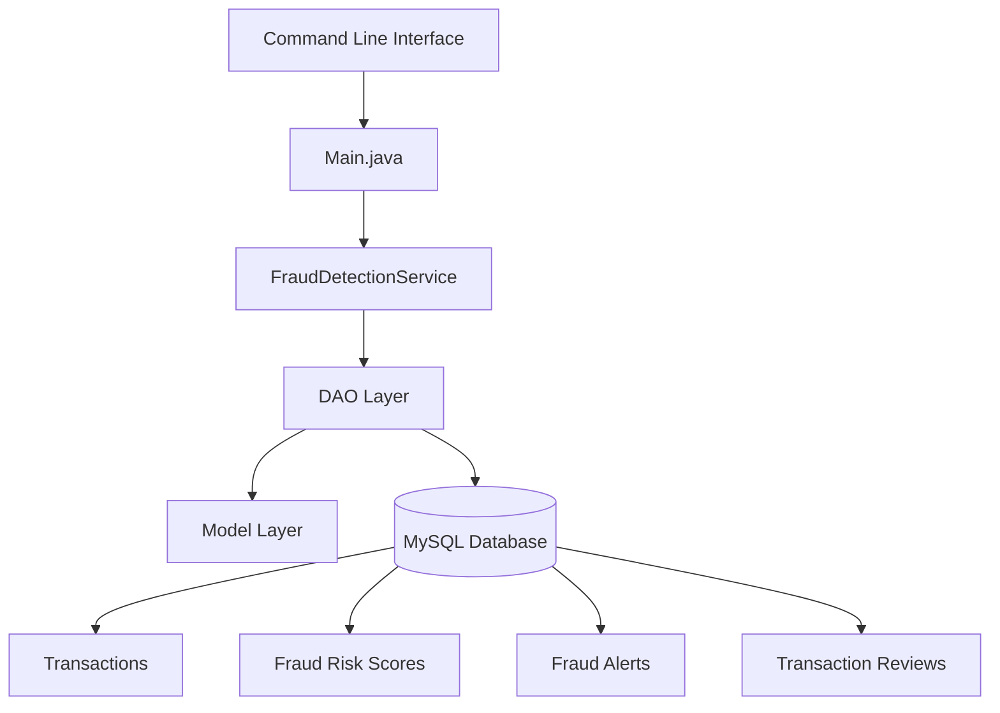

## Presentation Layer

```text
Main.java
```

Responsible for:

- User menu
- Admin menu
- Input handling
- Output
- Application flow

## Service Layer

```text
FraudDetectionService.java
```

Responsible for:

- Fraud analysis
- Risk calculation
- Risk classification
- Applying fraud detection rules

## DAO Layer

The DAO layer handles database operations.

```text
DashboardDAO.java
FraudAlertDAO.java
FraudRiskScoreDAO.java
PaymentDAO.java
TransactionReviewDAO.java
```

## Model Layer

The model layer represents application data.

```text
DashboardTransaction.java
FraudAlert.java
FraudRiskScore.java
Payment.java
Transaction.java
TransactionReview.java
```

## Utility Layer

```text
DBConnection.java
```

Responsible for establishing the JDBC connection to MySQL.

---

# 📁 Project Structure

```text
payshield-transaction-risk-system/
│
├── .gitignore
├── LICENSE
├── README.md
│
├── database/
│   ├── schema.sql
│   └── sample_data.sql
│
├── docs/
│   └── architecture.md
│
├── screenshots/
│   ├── 01-main-menu.png
│   ├── 02-user-transaction.png
│   ├── 03-fraud-alert.png
│   ├── 04-admin-dashboard.png
│   ├── 05-admin-review.png
│   └── 06-user-status.png
│
└── src/
    ├── Main.java
    │
    ├── dao/
    │   ├── DashboardDAO.java
    │   ├── FraudAlertDAO.java
    │   ├── FraudRiskScoreDAO.java
    │   ├── PaymentDAO.java
    │   └── TransactionReviewDAO.java
    │
    ├── model/
    │   ├── DashboardTransaction.java
    │   ├── FraudAlert.java
    │   ├── FraudRiskScore.java
    │   ├── Payment.java
    │   ├── Transaction.java
    │   └── TransactionReview.java
    │
    ├── service/
    │   └── FraudDetectionService.java
    │
    └── util/
        └── DBConnection.java
```

---

# 🗃️ Database Design

PayShield currently uses **MySQL** as the relational database.

The main database tables are:

```text
transactions
       │
       ├────────────── fraud_risk_scores
       │
       ├────────────── fraud_alerts
       │
       └────────────── transaction_reviews
```

## Transactions

Stores the original transaction information.

Typical information includes:

- Transaction ID
- Sender
- Receiver
- Amount
- Transaction Type
- Location
- Status
- Created Timestamp

## Fraud Risk Scores

Stores the result of fraud analysis.

Contains:

- Transaction ID
- Risk Score
- Risk Level
- Detection Timestamp

## Fraud Alerts

Stores alerts generated for suspicious transactions.

## Transaction Reviews

Stores:

- Transaction ID
- User explanation
- Review status
- Admin decision
- Review timestamp

---

# 🧩 Database Relationship

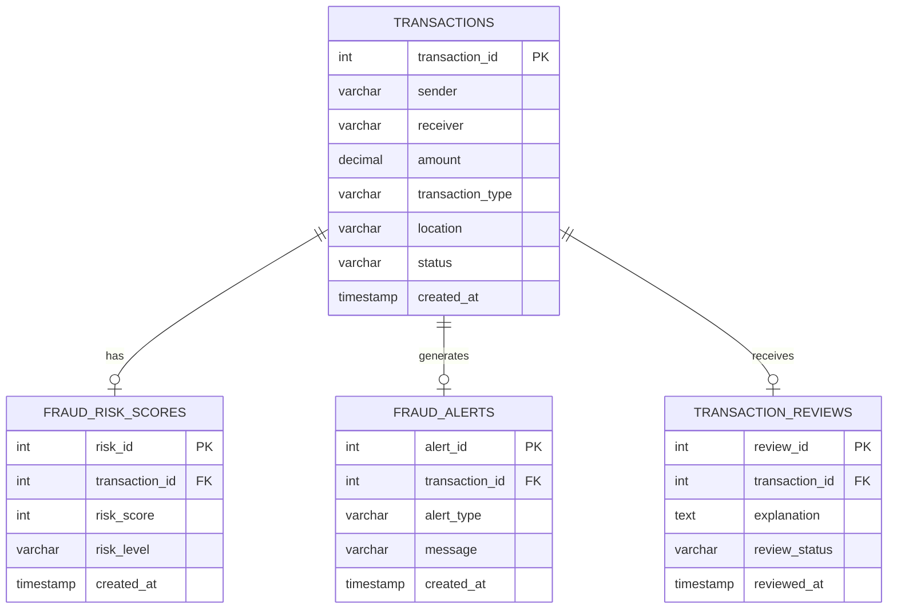

---

# 💻 Technology Stack

## Current Implementation

| Technology | Purpose |
|---|---|
| Java | Application development |
| Core Java | Business logic |
| JDBC | Database connectivity |
| MySQL | Relational database |
| Eclipse | Development environment |

## Planned Technologies

| Technology | Planned Purpose |
|---|---|
| Spring Boot | Backend application framework |
| REST API | Client-server communication |
| JWT | Authentication and authorization |
| Redis | Caching and high-speed data access |
| Docker | Containerization |
| AWS | Cloud deployment |
| Microservices | Service decomposition |
| Machine Learning | Intelligent fraud prediction |
| JUnit | Automated testing |

---

# ✅ Current Implementation

The following features are currently implemented:

- [x] Core Java application
- [x] JDBC database connectivity
- [x] MySQL database
- [x] Transaction creation
- [x] Transaction status tracking
- [x] Rule-based fraud detection
- [x] Risk score calculation
- [x] Risk classification
- [x] Fraud alert generation
- [x] Transaction review workflow
- [x] User explanation submission
- [x] Admin dashboard
- [x] Admin pending review list
- [x] Admin approval/rejection
- [x] User review status tracking

---

# 🛣️ Future Roadmap

PayShield is designed to evolve from a Core Java application into a production-style fraud detection backend.

## Phase 1 — Core Java + MySQL

**Completed**

```text
Core Java
     ↓
JDBC
     ↓
MySQL
     ↓
Rule-Based Fraud Detection
```

## Phase 2 — Spring Boot Backend

**Planned**

```text
Core Java Application
        ↓
Spring Boot
        ↓
REST APIs
        ↓
Service Layer
        ↓
Repository / DAO Layer
        ↓
MySQL
```

## Phase 3 — Security

**Planned**

- JWT authentication
- Role-based authorization
- Password hashing
- Secure API endpoints
- Input validation
- Centralized exception handling

## Phase 4 — Performance

**Planned**

- Redis caching
- Faster transaction lookup
- Real-time risk evaluation
- Optimized database queries

## Phase 5 — Cloud & Deployment

**Planned**

- Docker
- AWS
- Cloud database
- CI/CD
- Application monitoring
- Production deployment

## Phase 6 — Microservices

**Planned**

```text
API Gateway
     │
     ├── User Service
     ├── Transaction Service
     ├── Fraud Detection Service
     ├── Notification Service
     └── Review Service
              │
              ├── MySQL
              └── Redis
```

## Phase 7 — Machine Learning

The current implementation uses a rule-based fraud detection engine.

A future version will introduce machine learning for data-driven fraud prediction.

Potential features:

- Transaction amount
- Transaction frequency
- Location changes
- Transaction time
- Historical behavior
- Merchant information
- Device information
- Previous fraud patterns

Possible ML workflow:

```text
Historical Transactions
        ↓
Data Preprocessing
        ↓
Feature Engineering
        ↓
Model Training
        ↓
Fraud Prediction
        ↓
Risk Probability
        ↓
Business Decision
```

The ML layer can complement the existing rule engine rather than immediately replacing it.

---

# 🔐 Security Notes

Do not commit sensitive information to GitHub.

Never expose:

```text
Database passwords
API keys
JWT secrets
Encryption keys
Production credentials
Private configuration
```

Database credentials should remain local or be supplied through environment variables or local configuration excluded from Git.

Before publishing changes, verify that no real credentials are present in the source code.

---

# 🧪 Sample Data

The repository contains SQL scripts that can be used to create the database structure and optional demonstration data.

## Schema

```text
database/schema.sql
```

Creates:

```text
payment_fraud_detection
```

and the required tables.

## Sample Data

```text
database/sample_data.sql
```

Contains demonstration records for testing and presentation.

For a clean development environment:

1. Create the database using `schema.sql`.
2. Configure the local database connection.
3. Run the application.
4. Create transactions through the application.

Use `sample_data.sql` only when you want pre-populated demonstration records.

---

# ▶️ How to Run

## Prerequisites

Install:

- Java JDK
- MySQL Server
- MySQL Workbench
- Eclipse IDE
- MySQL JDBC Driver

## Step 1 — Clone the Repository

```text
https://github.com/sujithakrishna/payshield-transaction-risk-system
```

## Step 2 — Create the Database

Open MySQL Workbench.

Run:

```text
database/schema.sql
```

This creates the required database and tables.

## Step 3 — Configure Database Connection

Open:

```text
src/util/DBConnection.java
```

Configure your local MySQL connection.

Example structure:

```java
String url = "jdbc:mysql://localhost:3306/payment_fraud_detection";
String username = "root";
String password = "YOUR_LOCAL_PASSWORD";
```

Use your own local password.

Do not commit real production credentials.

## Step 4 — Add Sample Data (Optional)

If required, run:

```text
database/sample_data.sql
```

This step is optional.

## Step 5 — Run the Application

Open:

```text
src/Main.java
```

Run the Java application from Eclipse.

---

# 🖥️ Application Flow

## Main Menu

```text
1. User
2. Admin
0. Exit
```

## User Menu

```text
1. Create Transaction
2. My Transaction Status
0. Back
```

## Admin Menu

```text
1. Dashboard
2. View Pending Reviews
3. Process Review
0. Back
```

---

# 🔄 Example Transaction Flow

## Normal Transaction

```text
User
 ↓
Create Transaction
 ↓
Fraud Analysis
 ↓
LOW RISK
 ↓
Transaction Processed
```

## Suspicious Transaction

```text
User
 ↓
Create Transaction
 ↓
Fraud Analysis
 ↓
HIGH RISK
 ↓
Fraud Alert
 ↓
Transaction Pending Review
 ↓
User Provides Explanation
 ↓
Admin Reviews
 ↓
Approve / Reject
 ↓
User Checks Final Status
```

---

# 🎯 Learning Objectives

This project demonstrates practical understanding of:

- Object-Oriented Programming
- Java classes and objects
- Encapsulation
- Exception handling
- Collections
- JDBC
- SQL
- MySQL database design
- DAO pattern
- Service-layer architecture
- Transaction processing
- Rule-based fraud detection
- Risk scoring
- Risk classification
- CRUD operations
- Relational database relationships
- Backend application design
- Git and GitHub workflow

It also provides a foundation for learning:

- Spring Boot
- REST APIs
- Authentication
- Microservices
- Cloud deployment
- Redis
- Machine Learning

---

# 🔄 Project Evolution

PayShield is being developed incrementally.

## Version 1 — Core Java

```text
Core Java
+
JDBC
+
MySQL
```

## Version 2 — Fraud Detection

```text
Transaction Processing
+
Risk Rules
+
Risk Scoring
+
Fraud Alerts
```

## Version 3 — Review Workflow

```text
User Explanation
+
Admin Dashboard
+
Transaction Review
+
Approval / Rejection
+
Status Tracking
```

## Version 4 — Spring Boot

```text
Spring Boot
+
REST APIs
+
Layered Backend
```

## Version 5 — Secure Backend

```text
JWT
+
Role-Based Access
+
Password Hashing
+
Validation
```

## Version 6 — Scalable Architecture

```text
Redis
+
Docker
+
AWS
+
Microservices
```

## Version 7 — AI-Powered Fraud Detection

```text
Machine Learning
+
Behavioral Features
+
Fraud Prediction
+
Risk Probability
```

---

# 💡 Why This Project?

Fraud detection is a practical backend problem involving:

- High-volume transactions
- Risk assessment
- Database operations
- Business rules
- Security
- Real-time decision making
- Manual review
- Machine learning

PayShield combines these concepts into a single evolving project.

The initial implementation intentionally focuses on **Core Java and database fundamentals** before introducing more advanced backend and AI technologies.

This demonstrates the progression from:

```text
Programming Fundamentals
        ↓
Backend Development
        ↓
Database Engineering
        ↓
Fraud Detection
        ↓
Secure APIs
        ↓
Cloud & Microservices
        ↓
AI / Machine Learning
```

---

# 🏢 Long-Term Architecture

The intended production-style architecture is:

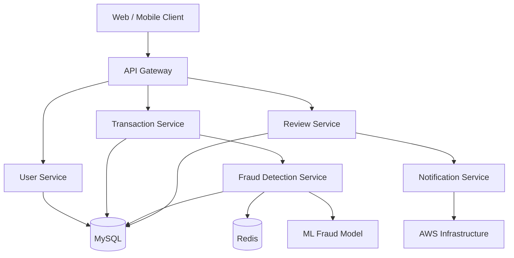

---

# 📚 Repository Documentation

Additional technical documentation is available in:

```text
docs/architecture.md
```

It covers:

- Current architecture
- Layer responsibilities
- Fraud detection rules
- Database relationships
- Spring Boot architecture roadmap
- REST API roadmap
- Security roadmap
- Redis integration
- Docker deployment
- AWS deployment
- Machine learning integration
- Microservices roadmap

---

# 🤝 Contributing

This project is primarily a personal portfolio and learning project.

Suggestions, improvements, and technical discussions are welcome.

If you want to contribute:

1. Fork the repository.
2. Create a feature branch.
3. Make your changes.
4. Test the changes.
5. Create a pull request.

---

# 📌 Project Status

**🚧 Actively Developing**

## Completed

```text
Core Java
JDBC
MySQL
Transaction Management
Rule-Based Fraud Detection
Risk Scoring
Fraud Alerts
Transaction Review
Admin Dashboard
Approval / Rejection
Status Tracking
```

## Planned

```text
Spring Boot
REST APIs
JWT Authentication
Redis
Docker
AWS
Microservices
Machine Learning
Automated Testing
```

The project is intentionally being developed step-by-step, starting with a Core Java and MySQL foundation and gradually moving toward an AI-enabled backend system.

---

# 👩‍💻 Author

**Sujitha V K**

Java Backend Developer

Focused on:

- Java
- Backend Development
- SQL & Databases
- Artificial Intelligence
- Machine Learning
- FinTech Systems

### Profiles

- GitHub: https://github.com/sujithakrishna
- LinkedIn: https://www.linkedin.com/in/sujitha-v-k-77a924258/

---

# 📄 License

This project is licensed under the MIT License.

See the [LICENSE](LICENSE) file for details.

---

# ⭐ If You Find This Project Useful

You can star the repository and follow the project as it evolves from a **Core Java transaction management application** into an **AI-powered fraud detection backend system**.
