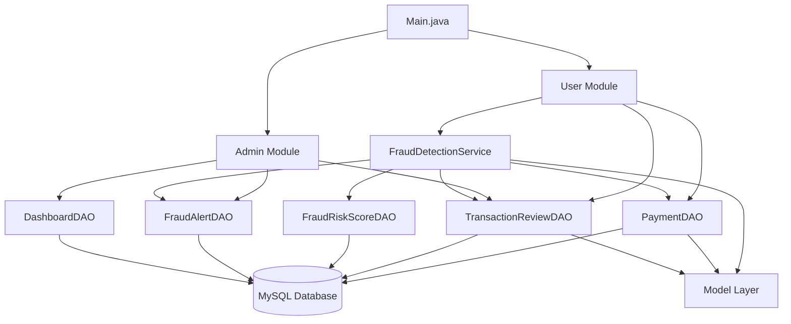
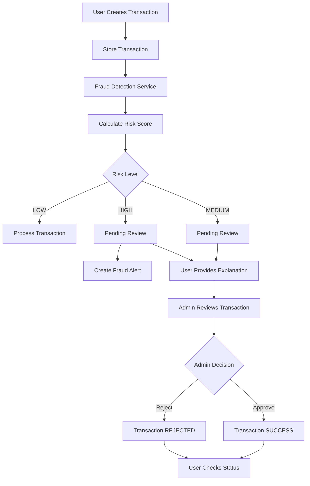
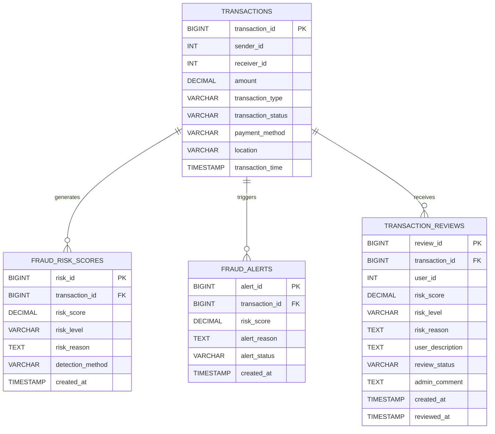
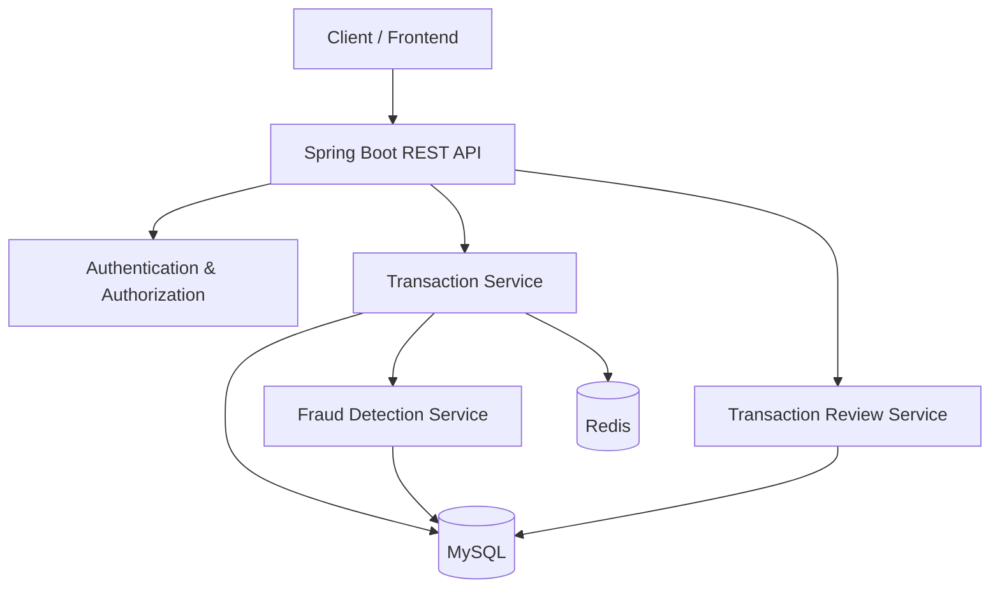
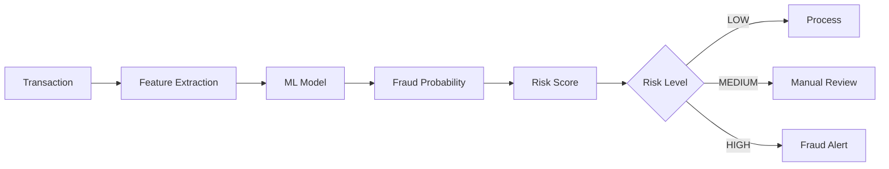
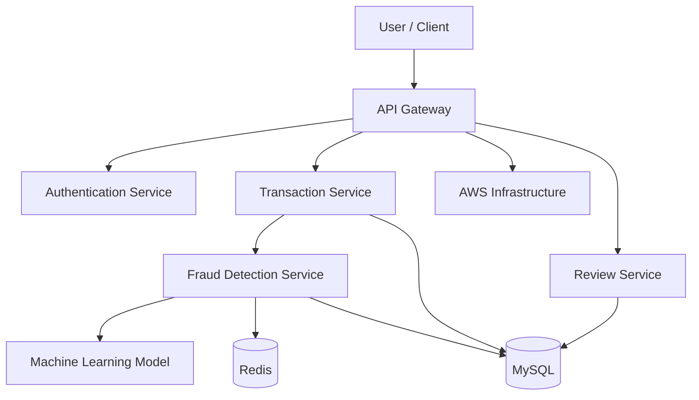

# 🏗️ PayShield Architecture

> **PayShield — Intelligent Transaction Risk & Payment Management System**

This document describes the current architecture of PayShield and the planned evolution of the system toward a scalable Spring Boot and AI-powered fraud detection platform.

---

## 📌 1. Architecture Overview

PayShield currently follows a layered backend architecture using:

- Core Java
- JDBC
- DAO pattern
- Service layer
- Model classes
- MySQL

The architecture separates application flow, business logic, database operations and domain models.



---

# 👤 2. Application Entry Point

The application starts from:

```text
Main.java
```

The main application provides separate interaction paths for:

```text
                    PayShield
                       |
             +---------+---------+
             |                   |
             v                   v
           User                Admin
             |                   |
             v                   v
      Transactions        Dashboard / Reviews
```

The current implementation uses a command-line interface to demonstrate the backend business workflows.

---

# 🧩 3. Application Layers

## 3.1 Application Layer

The application layer is responsible for controlling the overall user and administrator flow.

Main class:

```text
AI_Powered_Payment_Fraud_Detection_System/
└── Main.java
```

Responsibilities include:

- Displaying menus
- Accepting user input
- Calling application operations
- Managing user flow
- Managing admin flow
- Displaying transaction and review results

---

## 3.2 Service Layer

The service layer contains business logic that should not be tightly coupled to the user interface or direct database operations.

Current service:

```text
service/
└── FraudDetectionService.java
```

The fraud detection service evaluates transaction characteristics and calculates a risk score.

The service acts as the decision-making layer between transaction processing and persistence.

```text
Transaction
     |
     v
FraudDetectionService
     |
     +----------------------+
     |                      |
     v                      v
Risk Calculation       Risk Classification
     |                      |
     +----------+-----------+
                |
                v
        Transaction Decision
```

---

# 🗄️ 4. DAO Layer

The Data Access Object layer is responsible for database communication.

Current DAOs:

```text
dao/
├── DashboardDAO.java
├── FraudAlertDAO.java
├── FraudRiskScoreDAO.java
├── PaymentDAO.java
└── TransactionReviewDAO.java
```

### PaymentDAO

Responsible for payment and transaction-related database operations.

### TransactionReviewDAO

Responsible for transaction review operations, including user review submissions and administrator decisions.

### FraudRiskScoreDAO

Responsible for storing and retrieving transaction risk scores.

### FraudAlertDAO

Responsible for fraud alert records generated for suspicious transactions.

### DashboardDAO

Responsible for retrieving transaction information required by the administrator dashboard.

---

# 📦 5. Model Layer

The model layer represents the application's domain objects.

```text
Model/
├── DashboardTransaction.java
├── FraudAlert.java
├── FraudRiskScore.java
├── Payment.java
├── Transaction.java
└── TransactionReview.java
```

The model classes represent information such as:

- Transactions
- Payments
- Risk scores
- Fraud alerts
- Transaction reviews
- Dashboard transaction data

This keeps domain data separate from application and database logic.

---

# 🔌 6. Database Connectivity

Database connectivity is handled through:

```text
util/
└── DBConnection.java
```

The application communicates with MySQL through JDBC.

```text
Java Application
       |
       v
    JDBC
       |
       v
    MySQL
```

The database connection configuration is kept separate from the DAO classes so that database access can be reused across the application.

---

# 🔄 7. Transaction Processing Flow

The transaction lifecycle follows this general flow:



---

# 🔎 8. Fraud Detection Architecture

The current fraud detection implementation is **rule-based**.

The system evaluates multiple transaction characteristics.

```text
                 Transaction
                      |
                      v
          +-----------------------+
          | Fraud Detection       |
          | Service               |
          +-----------+-----------+
                      |
          +-----------+-----------+
          |           |           |
          v           v           v
       Amount     Frequency    Duplicate
          |           |           |
          +-----------+-----------+
                      |
                      v
               Location Check
                      |
                      v
               Risk Calculation
                      |
                      v
                Risk Score
```

---

# 📊 9. Risk Calculation

The current risk score is based on multiple rules.

```text
Risk Score =
    Amount Risk
  + Frequency Risk
  + Duplicate Risk
  + Location Risk
```

The system then classifies the transaction.

```text
Risk Score
    |
    +-------------------+
    |                   |
    v                   v
Risk Classification    Risk Reason
    |
    +-------+--------+
    |       |        |
    v       v        v
   LOW   MEDIUM     HIGH
```

---

# 🚨 10. Fraud Detection Rules

## High Transaction Amount

Transactions above the configured threshold contribute additional risk points.

Current threshold:

```text
₹10,000
```

Risk contribution:

```text
+40 points
```

---

## High Transaction Frequency

The system checks recent transaction activity for the sender.

The current implementation evaluates transactions within a defined time window.

If unusually frequent transaction activity is detected:

```text
+30 points
```

---

## Duplicate Transaction

The system checks for potentially duplicate transactions using transaction characteristics such as:

- Sender
- Receiver
- Amount
- Transaction type

A matching recent transaction contributes:

```text
+20 points
```

---

## Different Location

The system compares recent transaction locations associated with the sender.

A suspicious location change contributes:

```text
+30 points
```

---

# 📈 11. Risk Classification

The current classification is:

| Risk Score | Risk Level |
|------------|------------|
| `< 30` | LOW |
| `30–69` | MEDIUM |
| `70+` | HIGH |

The resulting decision is:

```text
LOW
 |
 +--> Process normally


MEDIUM
 |
 +--> PENDING_REVIEW
       |
       +--> User explanation
       |
       +--> Admin review


HIGH
 |
 +--> PENDING_REVIEW
 |
 +--> Fraud Alert
       |
       +--> Admin review
```

---

# 📝 12. Transaction Review Workflow

The transaction review workflow is one of the main features of PayShield.

When a transaction requires additional verification:

```text
Transaction
     |
     v
Risk Analysis
     |
     v
MEDIUM / HIGH
     |
     v
PENDING_REVIEW
     |
     v
User Provides Explanation
     |
     v
Admin Reviews
     |
     +----------------+
     |                |
     v                v
  APPROVE           REJECT
     |                |
     v                v
 SUCCESS           REJECTED
```

---

# 👤 13. User Review Status

After submitting a transaction for review, the user can check its current status.

This prevents the workflow from ending at:

```text
User → Submit Review
```

Instead, the user can follow the complete lifecycle:

```text
Submit Review
      |
      v
PENDING_REVIEW
      |
      +----------------+
      |                |
      v                v
  APPROVED          REJECTED
      |                |
      v                v
 SUCCESS            REJECTED
```

This creates a complete feedback loop between the user and administrator.

---

# 👨‍💼 14. Admin Review Workflow

The administrator can access transaction and review information.

```text
Admin
  |
  +--> Dashboard
  |
  +--> Pending Reviews
  |
  +--> Transaction Details
  |
  +--> Risk Information
  |
  +--> User Explanation
  |
  +--> Approve / Reject
```

When the administrator makes a decision, the transaction and review status are updated in the database.

---

# 🚨 15. Fraud Alert Flow

High-risk transactions can generate fraud alerts.

```text
High-Risk Transaction
         |
         v
   Risk Score >= 70
         |
         v
    Fraud Alert
         |
         +--> Transaction ID
         +--> Risk Score
         +--> Alert Reason
         +--> Alert Status
         +--> Created At
```

The alert is stored separately from the transaction so that suspicious activity can be tracked independently.

---

# 🗃️ 16. Database Architecture

The current database contains four primary tables:

```text
                     transactions
                           |
             +-------------+-------------+
             |             |             |
             v             v             v
     fraud_risk_scores  fraud_alerts  transaction_reviews
```

---

# 🔗 17. Database Relationships



---

# 🧱 18. Database Query Optimization

Indexes are included for frequently accessed transaction data.

For example:

```sql
INDEX idx_sender_time
(sender_id, transaction_time)
```

This supports queries that examine recent transaction activity for a particular sender.

Additional indexes are used for:

```text
Transaction Status
Risk Level
Review Status
User ID
Transaction ID
```

The goal is to reduce unnecessary database scanning as transaction volume increases.

---

# 📁 19. Project Structure

```text
PayShield/
│
├── src/
│   │
│   ├── AI_Powered_Payment_Fraud_Detection_System/
│   │   └── Main.java
│   │
│   ├── dao/
│   │   ├── DashboardDAO.java
│   │   ├── FraudAlertDAO.java
│   │   ├── FraudRiskScoreDAO.java
│   │   ├── PaymentDAO.java
│   │   └── TransactionReviewDAO.java
│   │
│   ├── Model/
│   │   ├── DashboardTransaction.java
│   │   ├── FraudAlert.java
│   │   ├── FraudRiskScore.java
│   │   ├── Payment.java
│   │   ├── Transaction.java
│   │   └── TransactionReview.java
│   │
│   ├── service/
│   │   └── FraudDetectionService.java
│   │
│   └── util/
│       └── DBConnection.java
│
├── database/
│   ├── schema.sql
│   └── sample_data.sql
│
├── docs/
│   └── architecture.md
│
├── screenshots/
│   └── ...
│
├── README.md
├── .gitignore
└── LICENSE
```

---

# 💻 20. Current Technology Architecture

The current implementation is intentionally kept simple so that the core backend concepts can be developed first.

```text
Core Java
    |
    v
Business Logic
    |
    v
JDBC
    |
    v
MySQL
```

Current technologies:

| Technology | Role |
|------------|------|
| Java | Application development |
| Core Java | Business logic and OOP |
| JDBC | Database connectivity |
| MySQL | Persistent storage |
| MySQL Workbench | Database development |
| Eclipse | Development environment |

---

# 🔮 21. Planned Spring Boot Architecture

The next major development phase is migration from the current Java application toward a Spring Boot backend.

The planned architecture is:



This architecture is **planned**, not part of the current implementation.

---

# 🤖 22. Planned AI Fraud Detection

The current fraud detection system uses deterministic rules.

The planned AI phase will introduce machine-learning-based transaction risk prediction.

Potential features include:

```text
Transaction Amount
Transaction Frequency
Payment Method
Transaction Location
Duplicate Activity
Historical Behaviour
Time-based Patterns
Transaction Velocity
```

Planned architecture:



The machine-learning model will eventually complement the existing rule-based system.

---

# ⚙️ 23. Planned Backend Evolution

PayShield is being developed through multiple stages.

```text
                 CURRENT
                    |
                    v
          Core Java + MySQL
                    |
                    v
           JDBC + DAO Layer
                    |
                    v
        Rule-Based Risk Engine
                    |
                    v
        Transaction Review Flow
                    |
                    v
              Spring Boot
                    |
                    v
               REST APIs
                    |
                    v
             JWT Security
                    |
                    v
             Redis + Testing
                    |
                    v
              Docker + AWS
                    |
                    v
           Machine Learning
                    |
                    v
        Intelligent Fraud Detection
```

---

# 🛣️ 24. Development Roadmap

## Phase 1 — Core Backend

- [x] Core Java
- [x] JDBC
- [x] MySQL
- [x] DAO architecture
- [x] Transaction processing
- [x] Transaction status tracking

## Phase 2 — Risk Detection

- [x] Rule-based fraud detection
- [x] Risk scoring
- [x] Risk classification
- [x] Fraud alerts
- [x] Transaction review

## Phase 3 — Review System

- [x] User explanation
- [x] Admin review
- [x] Transaction approval
- [x] Transaction rejection
- [x] User-side review status

## Phase 4 — Spring Boot

- [ ] Spring Boot migration
- [ ] REST APIs
- [ ] DTO layer
- [ ] Validation
- [ ] Exception handling

## Phase 5 — Security

- [ ] JWT authentication
- [ ] Role-based authorization
- [ ] API security
- [ ] Secure configuration

## Phase 6 — Performance

- [ ] Redis
- [ ] Query optimization
- [ ] Concurrency handling
- [ ] Transaction management
- [ ] Automated testing

## Phase 7 — Deployment

- [ ] Docker
- [ ] AWS deployment
- [ ] Cloud database
- [ ] Logging and monitoring

## Phase 8 — AI

- [ ] Feature engineering
- [ ] Fraud dataset preparation
- [ ] ML model training
- [ ] Model evaluation
- [ ] Model integration
- [ ] Real-time risk prediction

## Phase 9 — Architecture Evolution

- [ ] Microservices
- [ ] Fraud Detection Service
- [ ] Transaction Service
- [ ] Review Service
- [ ] Event-driven processing

---

# 🎯 25. Design Goals

The architecture is being developed with the following engineering goals:

### Separation of Concerns

Application flow, business logic, database operations and domain models are separated.

### Maintainability

DAO and service components can be modified independently.

### Extensibility

The current rule-based fraud engine can later be extended with machine-learning models.

### Data Consistency

Transaction and review states are persisted in MySQL.

### Performance

Database indexes support frequently used transaction queries.

### Security

Future versions will introduce stronger authentication, authorization and secure configuration.

### Scalability

The planned Spring Boot and microservices architecture is intended to support larger transaction volumes and independent service scaling.

---

# 🧠 26. Engineering Concepts Demonstrated

PayShield provides practical implementation experience with:

```text
Object-Oriented Programming
        ↓
Java Collections & Exception Handling
        ↓
JDBC
        ↓
SQL & Relational Databases
        ↓
DAO Pattern
        ↓
Service Layer
        ↓
Business Rules
        ↓
Risk Scoring
        ↓
Transaction Workflows
        ↓
Fraud Detection
        ↓
Backend Architecture
```

Future stages will extend this into:

```text
REST APIs
Security
Caching
Testing
Cloud
Microservices
Machine Learning
```

---

# ⚠️ 27. Current vs Planned Components

To keep the project technically transparent:

| Component | Current Status |
|-----------|----------------|
| Core Java | ✅ Implemented |
| JDBC | ✅ Implemented |
| MySQL | ✅ Implemented |
| DAO Layer | ✅ Implemented |
| Service Layer | ✅ Implemented |
| Rule-Based Fraud Detection | ✅ Implemented |
| Risk Scoring | ✅ Implemented |
| Fraud Alerts | ✅ Implemented |
| Transaction Review | ✅ Implemented |
| Admin Approval/Rejection | ✅ Implemented |
| User Status Tracking | ✅ Implemented |
| Spring Boot | 🔜 Planned |
| REST APIs | 🔜 Planned |
| JWT | 🔜 Planned |
| Redis | 🔜 Planned |
| Docker | 🔜 Planned |
| AWS | 🔜 Planned |
| Machine Learning | 🔜 Planned |
| Microservices | 🔜 Planned |

---

# 🔐 28. Security Considerations

No production credentials should be stored in the repository.

The following must remain private:

```text
Database passwords
API keys
JWT secrets
Encryption keys
Cloud credentials
Production configuration
```

Local configuration should be managed outside the public GitHub repository.

---

# 📌 29. Architecture Principles

PayShield follows these principles:

```text
                    Clean Separation
                          |
              +-----------+-----------+
              |           |           |
              v           v           v
          Business      Data       Models
           Logic       Access
              |           |
              +-----+-----+
                    |
                    v
                 MySQL
```

The architecture is intentionally being evolved rather than implementing every technology simultaneously.

This allows each layer to be understood and tested before introducing additional infrastructure.

---

# 🚀 30. Long-Term Vision

The long-term objective is to evolve PayShield into an intelligent financial transaction platform capable of:

```text
Secure Transaction Processing
             +
Real-Time Risk Analysis
             +
Automated Fraud Detection
             +
Human Review
             +
Machine Learning
             +
Scalable Backend Infrastructure
```

The final conceptual architecture is:



> **Note:** This represents the long-term architectural direction of PayShield. The current repository implements the Core Java + JDBC + MySQL foundation and rule-based fraud detection workflow.

---

# 📚 31. Documentation Roadmap

As PayShield evolves, this documentation will be expanded with:

- REST API documentation
- API request/response examples
- Database schema documentation
- Fraud detection rule documentation
- Machine-learning model documentation
- Testing strategy
- Deployment architecture
- AWS infrastructure
- Architecture decision records

---

# 🏁 Conclusion

PayShield is being developed as a progressive backend engineering project.

The current implementation establishes the foundation:

```text
Core Java
+
JDBC
+
MySQL
+
DAO Architecture
+
Rule-Based Fraud Detection
+
Transaction Review Workflow
```

The planned evolution introduces:

```text
Spring Boot
+
REST APIs
+
JWT
+
Redis
+
Docker
+
AWS
+
Machine Learning
+
Microservices
```

The goal is to evolve the project from a Java-based transaction management application into a scalable and intelligent financial backend system.

---

**PayShield — Building secure and intelligent transaction systems, one layer at a time.**